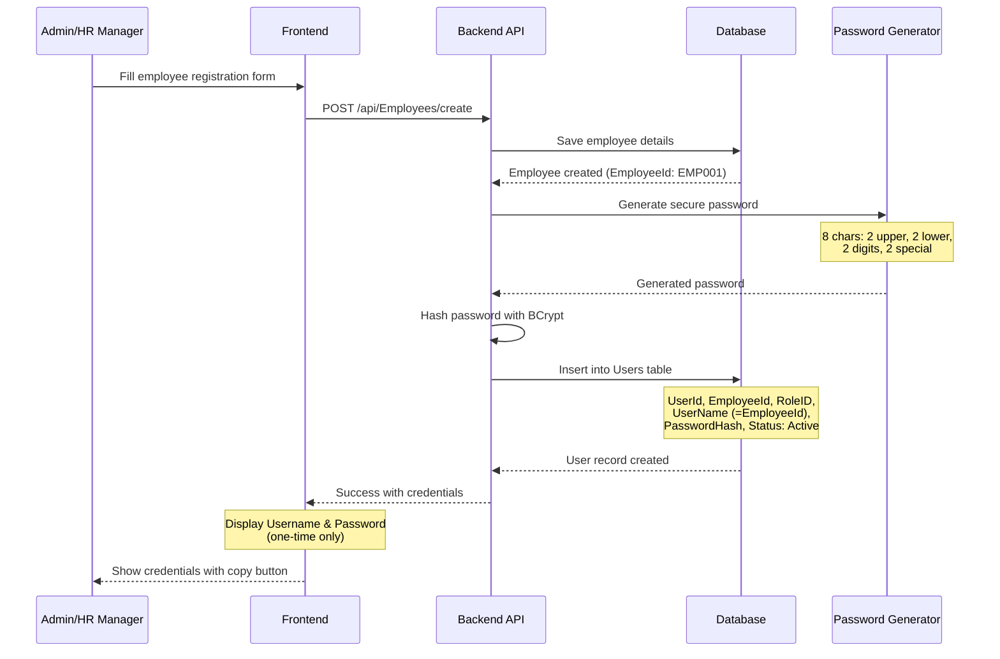
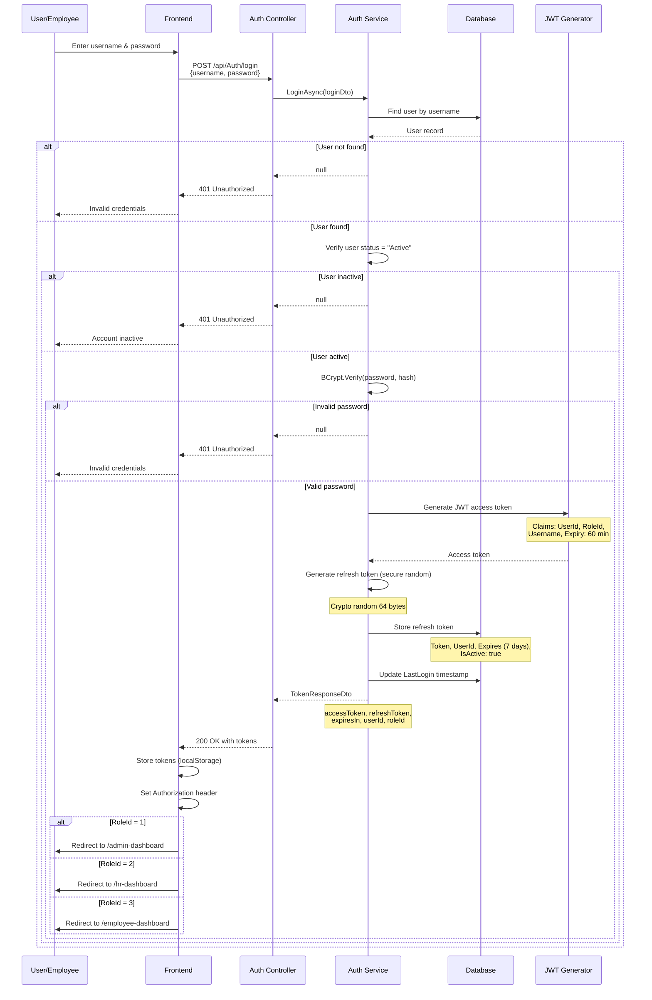
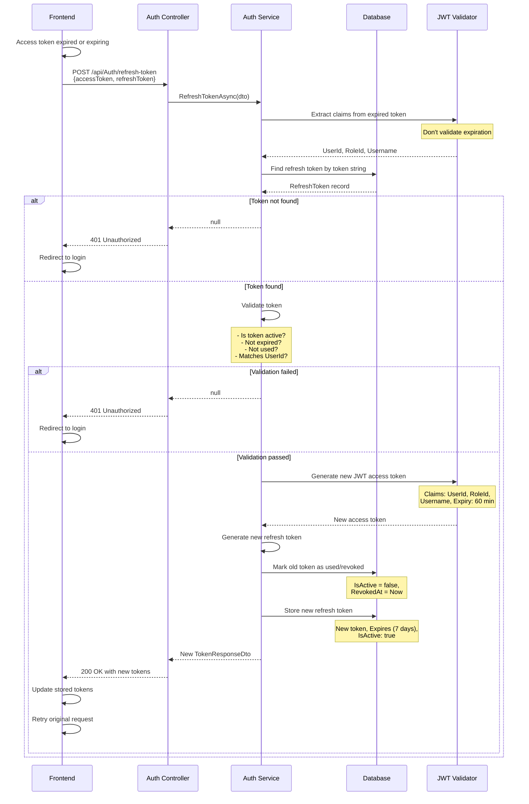
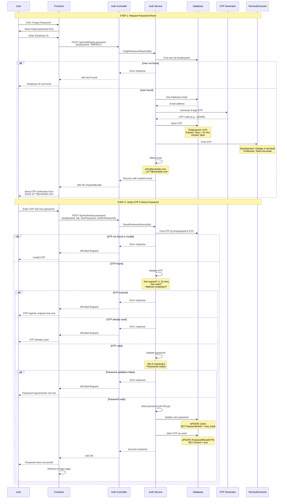
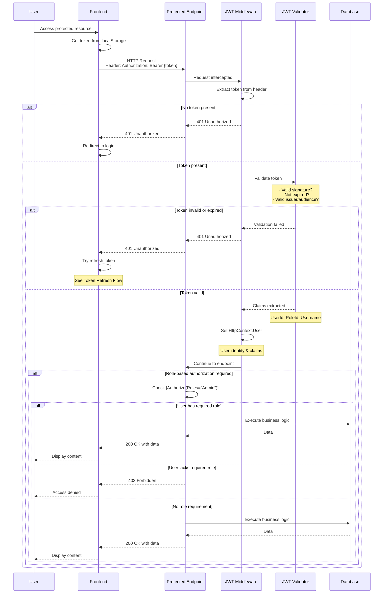
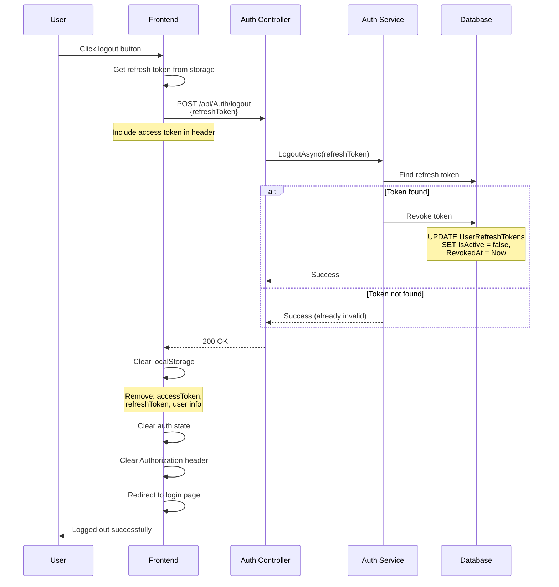

# Authentication Flow Diagrams

This document provides comprehensive visual diagrams for all authentication flows in the SLBFE HRM System.

## Table of Contents
1. [Employee Registration & Credential Generation](#1-employee-registration--credential-generation)
2. [Login Authentication Flow](#2-login-authentication-flow)
3. [JWT Token Refresh Flow](#3-jwt-token-refresh-flow)
4. [Forgot Password Flow](#4-forgot-password-flow)
5. [Token Validation & Authorization Flow](#5-token-validation--authorization-flow)
6. [Logout Flow](#6-logout-flow)

---

## 1. Employee Registration & Credential Generation

When a new employee is registered, the system automatically generates login credentials.



---

## 2. Login Authentication Flow

Main authentication flow with JWT access token and refresh token generation.



---

## 3. JWT Token Refresh Flow

Automatic token refresh when access token expires or is about to expire.



---

## 4. Forgot Password Flow

Complete password recovery process with OTP verification.



---

## 5. Token Validation & Authorization Flow

How the system validates JWT tokens for protected endpoints.



---

## 6. Logout Flow

User logout process with token revocation.



---

## Security Features

### 1. **Password Security**
- BCrypt hashing with salt (work factor: 12)
- Minimum 8 characters for generated passwords
- Minimum 6 characters for user-set passwords
- Secure random generation for initial passwords

### 2. **Token Security**
- JWT signed with HS256 algorithm
- Access token: 60 minutes expiry
- Refresh token: 7 days expiry
- Refresh tokens stored securely in database
- Token revocation on logout
- One-time use refresh tokens (rotated on each refresh)

### 3. **OTP Security**
- 6-digit cryptographically secure random OTP
- 10-minute expiration window
- Single-use tokens
- Stored in database with IsUsed flag

### 4. **Authentication Checks**
- User status validation (Active/Inactive)
- Password hash verification with BCrypt
- Token expiration validation
- Role-based access control (RBAC)
- Automatic token refresh before expiration

### 5. **Authorization Levels**
- **Admin (RoleId: 1)**: Full system access
- **HR Manager (RoleId: 2)**: Employee management, reports
- **Employee (RoleId: 3)**: Personal data, self-service features

---

## API Endpoints Summary

| Endpoint | Method | Purpose | Auth Required |
|----------|--------|---------|---------------|
| `/api/Auth/login` | POST | User login | No |
| `/api/Auth/refresh-token` | POST | Refresh access token | No* |
| `/api/Auth/logout` | POST | Revoke refresh token | Yes |
| `/api/Auth/forgot-password` | POST | Request password reset OTP | No |
| `/api/Auth/reset-password` | POST | Reset password with OTP | No |
| `/api/Employees/create` | POST | Create employee & credentials | Yes (Admin/HR) |

*Refresh token endpoint doesn't require active JWT, but needs valid refresh token

---

## Error Codes

| Code | Description | Scenario |
|------|-------------|----------|
| 200 | Success | Operation completed successfully |
| 400 | Bad Request | Invalid input data, password validation failed |
| 401 | Unauthorized | Invalid credentials, expired token, no token |
| 403 | Forbidden | Valid token but insufficient permissions |
| 404 | Not Found | User/employee not found |
| 500 | Internal Server Error | Server-side error |

---

## Frontend Token Management

### Storage
```typescript
// After successful login
localStorage.setItem('accessToken', response.accessToken);
localStorage.setItem('refreshToken', response.refreshToken);
localStorage.setItem('userId', response.userId);
localStorage.setItem('roleId', response.roleId);
```

### Request Interceptor
```typescript
// Add token to all requests
axios.interceptors.request.use(config => {
  const token = localStorage.getItem('accessToken');
  if (token) {
    config.headers.Authorization = `Bearer ${token}`;
  }
  return config;
});
```

### Response Interceptor (Auto-refresh)
```typescript
// Auto-refresh on 401 errors
axios.interceptors.response.use(
  response => response,
  async error => {
    if (error.response?.status === 401 && !error.config._retry) {
      error.config._retry = true;
      const newToken = await refreshAccessToken();
      if (newToken) {
        error.config.headers.Authorization = `Bearer ${newToken}`;
        return axios(error.config);
      }
    }
    return Promise.reject(error);
  }
);
```

---

## Related Documentation

- [JWT Authentication Implementation](./JWT_AUTHENTICATION_IMPLEMENTATION.md) - Detailed technical implementation
- [Login Authentication Implementation](./LOGIN_AUTHENTICATION_IMPLEMENTATION.md) - Login system details
- [Forgot Password Feature](./FORGOT_PASSWORD_FEATURE.md) - Password recovery process
- [JWT Authentication Quick Reference](./JWT_AUTHENTICATION_QUICK_REFERENCE.md) - Quick API reference

---

**Last Updated**: January 28, 2026  
**Version**: 1.0
